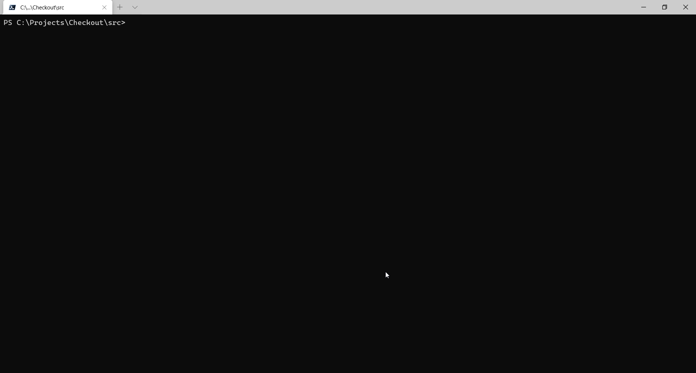

# Payment Gateway API

The Payment Gateway API provides merchant to process payment on customer. API accepts credit card data such as credit number, Cvv, expiry month and year.
There are 4 endpoints

	1. Authorize
	2. Capture
	3. Refund
	4. Void

## Assumptions

- Only In-Memory data store has been used. For production purpose that can be replaced by using SQL Server. This can be achieved by updating connection string in [appsettings.json](/src/PaymentGatewayAPI/appsettings.json). This is already setup in [Startup.cs](/src/PaymentGatewayAPI/Startup.cs)
- Implemented minimum validation to avoid complexity
- Authorization Edge case is implemented by using hard coded BlackListCard list
- For Capture Edge Case seed method is used to save customer and transactionId `bc97198e-7ff2-45d1-96b8-408781ffb878` will be used
- For Refund Edge case seed method is used to save customer and transactionId `e96e72cf-2cc3-4b8c-9dec-b056979dccaa` will be used

## Improvements

- Authentication for Merchant can be added.
- Validation can be improved e.g if Month/Year is expired and many more. 

## Dev - Dependencies

### Tools
- Visual Studio Code or 2019
- Docker
- Powershell

### Libraries
- [EF Core](https://docs.microsoft.com/en-us/ef/) : database mapper for .NET
- [Serilog](https://serilog.net/) : for logging
- [Swashbuckle.Aspnetcore](https://github.com/domaindrivendev/Swashbuckle.AspNetCore) : for [Swagger](https://swagger.io/) tooling for API's built with ASP.NET Core

## Build using Powershell

Run the below command to build the solution locally;

Execute [build.ps1](/src/build.ps1) to compile application and package release artifacts. Outputs to `/dist/` folder.

Below are some examples;

- Full Build: `PS> .\build.ps1`
- Debug Build: `PS> .\build.ps1 -Config "Debug"`
- Skip Tests: `PS> .\build.ps1 -SkipTests`

The build script also outputs the code coverage result. The coverage report files can be found under `dist\Coverage` folder. After the build process is executed you can open the coverage report using `dist\Coverage\index.html`



## Build using Docker

To Build, (re)create container image for service(s), run the below command:

``` shell
docker-compose build
```

To start, and attach to container for service(s), run: 

``` shell
docker-compose up
```

## Build using `dotnet` CLI

``` shell
dotnet build PaymentGatewayAPI.sln
```

``` shell
dotnet test PaymentGatewayAPI.sln
```

### Run the Payment Gateway API using `dotnet`

Run below command;

``` shell
cd "src\PaymentGatewayAPI\"
dotnet run WebApi.csproj
```

## Sample payload for API

- sample payload for `POST /api/authorize/` API

```json
{
    "cardNumber": "4000 0000 0000 0119",
    "expiryMonth":"03",
    "expiryYear":"2021",
    "Cvv": 123,
    "Amount": 10,
    "currency": "gbp"
}
```

- sample payload for `POST /api/capture/`, `POST /api/refund/` API

```json
{
    "transactionId": "79bf18b4-63fb-4c6d-aa4b-380d15a41b56",
    "amount": 6
}
```

- sample payload for `POST /api/void/` API

```json
{
    "transactionId": "79bf18b4-63fb-4c6d-aa4b-380d15a41b56"
}
